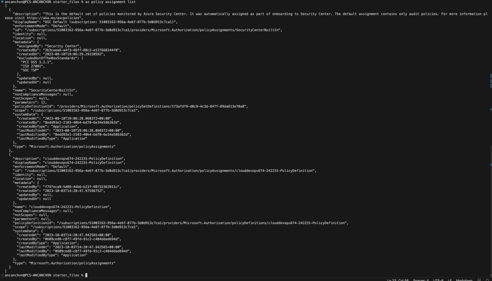
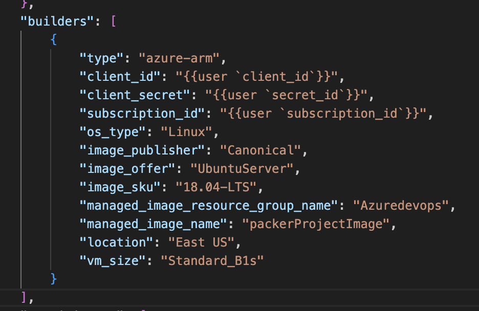
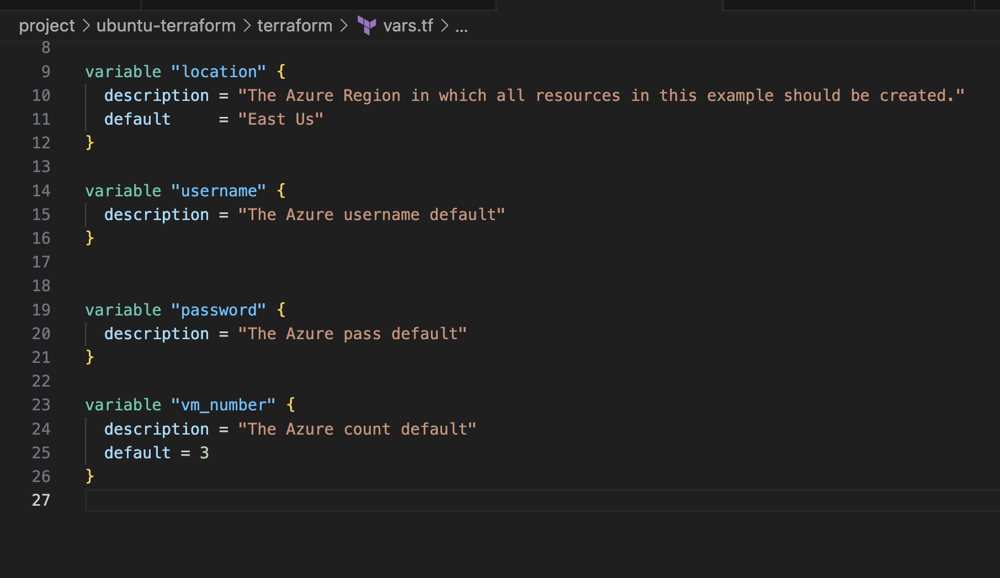
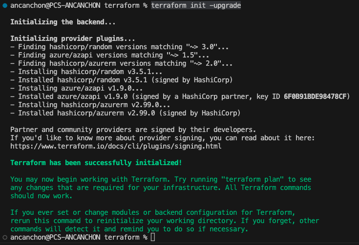
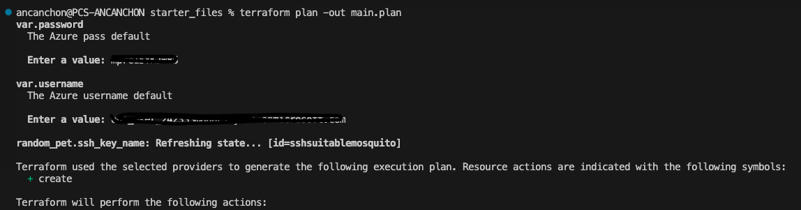

# Azure Infrastructure Operations Project: Deploying a scalable IaaS web server in Azure

## Introduction
For this project, you will write a Packer template and a Terraform template to deploy a customizable, scalable web server in Azure.

## Getting Started
1. Clone this repository

2. Create your infrastructure as code

3. Update this README to reflect how someone would use your code.

## Dependencies
1. Create an [Azure Account](https://portal.azure.com) 
2. Install the [Azure command line interface](https://docs.microsoft.com/en-us/cli/azure/install-azure-cli?view=azure-cli-latest)
3. Install [Packer](https://www.packer.io/downloads)
4. Install [Terraform](https://www.terraform.io/downloads.html)

## Instructions

## 1. login to azure

### 1. Run the following command to login to Azure:
    follow the instructions and connect with your account

```bash
    az login
```

## 2 create a policy definition 

### 1. create the json policy and run the next command in your terminal, in <name-policy> you can put the name and the path of your json is on <url_policy>

```bash
    az policy definition create --name <name-policy> --rules <url_policy>
```

### 2. see you policy json list with this command
```bash
    az policy assignment list
```

    it looks like
    

## 2 create a server image with packer

### 1. the server image going to running with packer, the name config will be saved in a file named  <server.json>, and we need to modify the enviroments in an file <.env> file.

### 2. Next wo going go to create the builders, something like that



### 3. finally you need to run:

```bash
    packer build server.json
```

## deploy terraform linux server

1. locate the folter /terraform and in the file <vars.tf> you can put the envoroments in a new  key named <default> to connect with you azure account and create the vm without problems, or in your terminal it ask to you the envs, the file looks like this:




### 2. make sure that you have terraform in folder /terraform init with:
```bash
    terraform init
```

### 3. install plugins in folder /terraform
```bash
    terraform init -upgrade
```
    console looks like



### 4. run the terraform in folder /terraform plan with
```bash
    terraform plan -out main.plan
```
    console looks like this



### 5. apply terraform plan with 
```bash
    terraform apply main.plan
```
### 6. Destroy flag with

```bash
    terraform plan -destroy -out main.destroy.plan
```

## Output


### policy definitions

1. create policy


2. list policy


### Server with packer

1. builders


### Terraform create VM
1. Init terraform


2. terraform plan
